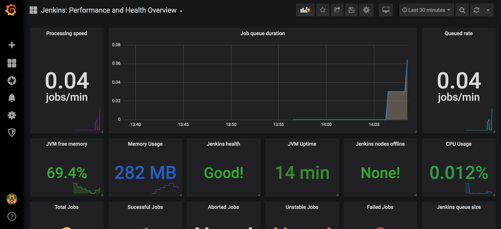

### 1.Set up Jenkins, prometheus, grafana

```bash
docker run -d --name jenkins -p 8081:8080 -p 50000:50000 jenkins
docker run -d --name prometheus -p 9090:9090 prom/prometheus
docker run -d --name grafana -p 3000:3000 grafana/grafana
```

### 2. Configure Jenkins prometheus

##### 2.1 Install necessary plugin in Jenkins
Go to “manage Jenkins” then “manage plugins” and install “Prometheus metrics”.

**Prometheus metrics**

`docker restart jenkins`

>prometheus plugin doesn’t support dynamic loading. Jenkins needs to be restarted for the update to take effect.

> You can see the output of this plugin visiting this URL
“http://Jenkins_HOST:PORT/prometheus”


##### 2.2 Configure Prometheus to scrape metrics from Jenkins:
In the scrape_configs part you need to add a job for Jenkins server:


```bash
docker exec -it prometheus sh

tee -a /etc/prometheus/prometheus.yml <<EOF
  - job_name: jenkins
    metrics_path: /prometheus
    static_configs:
      - targets: ['172.17.0.1:8081']
EOF
```

> 172.17.0.1 docker bridges ip
`docker restart prometheus`

check it: go to http://localhost:9090/targets


### 3.Add dashboard on grafana


- 1.Go to Grafana server <localhost:3000> and login. The default user and password are “admin/admin”

- 2.From “ Home Dashboard” click on “add data source” then click on “Prometheus”.

- 3. add a exist dashboard 


id 9964


### 4.Finally 




---

Ref:
- https://medium.com/@eng.mohamed.m.saeed/monitoring-jenkins-with-grafana-and-prometheus-a7e037cbb376
- https://medium.com/@gangsta_black/grafana-cool-dashboard-for-monitoring-jenkins-with-prometheus-c7ba4f1c6297